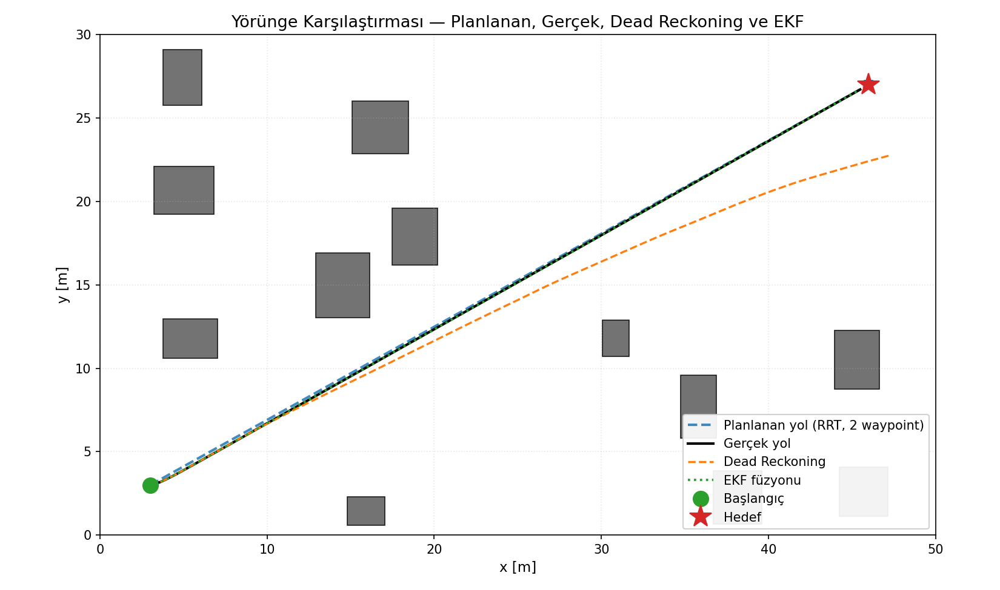

# Sensör Füzyonu ve Lokalizasyon Kullanarak LiDAR Tabanlı Otonom Navigasyon

İki boyutlu bir simülasyon ortamında diferansiyel sürüşlü mobil bir robotun
LiDAR, IMU ve tekerlek enkoderi sensörleriyle gürültülü çevre koşullarında
otonom navigasyonunu uçtan uca gerçekleyen Python tabanlı, modüler bir
Ar-Ge prototipi. Lokalizasyon adımı dead reckoning ile karşılaştırmalı
olarak **Extended Kalman Filter (EKF)** sensör füzyonu üzerinden çözülür;
yol planlama ise **RRT (global) + APF (lokal)** hibrit yaklaşımıyla
gerçekleştirilir. Tüm parametreler tek bir YAML konfigürasyon dosyasından
yönetilir; aynı seedle yapılan koşumlar birebir tekrarlanabilir.



> **Baz senaryo özet sonuçları** (`seed=42`, 50×30 m ortam, 12 engel):
> hedefe **43.25 s**'de çarpışmasız ulaşılmıştır.
> EKF füzyonu, dead reckoning'e göre konum hatasını **~63 kat**
> azaltarak son konum hatasını **4.35 m**'den **0.025 m**'ye düşürmüştür.

---

## İçindekiler

- [Özellikler](#özellikler)
- [Hızlı Başlangıç](#hızlı-başlangıç)
- [Kurulum](#kurulum)
- [Kullanım](#kullanım)
- [Proje Yapısı](#proje-yapısı)
- [Modüller](#modüller)
- [Konfigürasyon](#konfigürasyon)
- [Çıktılar](#çıktılar)
- [Sonuçlar](#sonuçlar)
- [Alternatif Senaryolar](#alternatif-senaryolar)
- [Akademik Referanslar](#akademik-referanslar)
- [Yapay Zeka Kullanım Beyanı](#yapay-zeka-kullanım-beyanı)

---

## Özellikler

- **2B simülasyon çekirdeği** — eksen hizalı dikdörtgen + dairesel engel
  polimorfizmi, ışın atışı (slab/quadratic), robot yarıçapı dahil
  çarpışma denetimi.
- **Non-holonomic robot dinamiği** — diferansiyel sürüş kinematiği, hız ve
  ivme limitleri, Euler integrasyonu.
- **Gerçekçi sensör modelleri** — LiDAR (360°, Gauss menzil + açı gürültüsü,
  dropout), IMU (gürültü + sabit bias), tekerlek enkoderi (her teker
  bağımsız gürültü, opsiyonel niceleme).
- **LiDAR önişleme** — mesafe eşikleme, dairesel medyan filtre,
  mesafe + komşuluk tabanlı kümeleme (360° wrap-around).
- **Lokalizasyon karşılaştırması** — Dead Reckoning ve EKF (encoder
  *predict* + IMU yaw *update*, açı sarmalama düzeltmesiyle).
- **Hibrit navigasyon** — RRT global yol arama (goal-bias + kısayol
  yumuşatma) + APF reaktif engelden kaçınma; non-holonomic kontrolcü.
- **Tekrarlanabilirlik** — tek master seed üzerinden etiket bazlı bağımsız
  `np.random.Generator` dalları; aynı konfig + seed → bit-bit aynı çıktı.
- **Otomatik çıktı kayıt sistemi** — yörünge CSV, metrik CSV, özet JSON,
  6 yayın kalitesinde PNG ve PDF rapor.
- **Konfigürasyon kalıtımı (`extends:`)** — alternatif senaryolar yalnızca
  baz YAML'dan farkları belirterek tanımlanır.

## Hızlı Başlangıç

```bash
git clone <repo-url>
cd autonomous_navigation_2d

pip install -r requirements.txt

# Baz senaryo: simülasyonu çalıştır ve tüm görselleri üret
python main.py --config config/config.yaml
```

Çıktılar [`outputs/figures/`](outputs/figures) ve
[`outputs/results/`](outputs/results) altında, derlenmiş rapor
[`report/report.pdf`](report/report.pdf) konumunda bulunur.

## Kurulum

**Gereksinimler:** Python ≥ 3.10. Bağımlılıklar:

```text
numpy>=1.24
matplotlib>=3.7
pyyaml>=6.0
scipy>=1.10
reportlab>=4.0
```

İzole bir sanal ortamda kurmak önerilir:

```bash
python -m venv .venv
.venv\Scripts\activate          # Windows
source .venv/bin/activate       # macOS / Linux
pip install -r requirements.txt
```

Türkçe karakterli PDF üretimi için Arial fontu kullanılır; Windows'ta
sistemde hazır gelir, diğer platformlarda font otomatik olarak
Helvetica'ya düşer.

## Kullanım

### Tek komutla tam pipeline

```bash
python main.py --config config/config.yaml
```

Bu komut sırasıyla şu adımları yürütür:

1. Ortamı kurar (12 engel, başlangıç ve hedef).
2. RRT ile global yolu planlar; kısayol yumuşatması uygular.
3. Diferansiyel sürüşlü robotu sensörlerle birlikte simüle eder.
4. Dead Reckoning ve EKF'yi paralel olarak yürütür.
5. LiDAR her adımında işler (filtreleme + kümeleme).
6. Tüm yörüngeleri ve metrikleri kaydeder.
7. 6 yayın kalitesinde PNG görsel üretir.

### Farklı bir konfigürasyon ile koşum

```bash
python main.py --config experiments/high_noise.yaml
python main.py --config experiments/dense_obstacles.yaml
```

## Proje Yapısı

```text
autonomous_navigation_2d/
├── main.py                    # Tek komutla pipeline giriş noktası
├── requirements.txt
├── README.md
├── .gitignore
│
├── config/
│   └── config.yaml            # Baz konfigürasyon (tüm parametreler)
│
├── experiments/               # Bonus senaryolar (extends: ile farkları içerir)
│   ├── high_noise.yaml
│   └── dense_obstacles.yaml
│
├── src/                       # Simülasyon kütüphanesi (OOP)
│   ├── __init__.py
│   ├── utils.py               # ConfigLoader, RandomContext, geometri
│   ├── logger.py              # ExperimentLogger (konsol + dosya)
│   ├── environment.py         # Environment2D + Obstacle hiyerarşisi
│   ├── robot.py               # DifferentialDriveRobot (non-holonomic)
│   ├── sensors.py             # LiDAR, IMU, WheelEncoder + BaseSensor
│   ├── lidar_processing.py    # Eşikleme, medyan filtre, kümeleme
│   ├── localization.py        # DeadReckoning, ExtendedKalmanFilter
│   ├── navigation.py          # RRTPlanner, APFController, HybridNavigator
│   ├── metrics.py             # RMSE / MAE, MetricsAnalyzer
│   ├── visualization.py       # SimulationVisualizer (6 grafik)
│   └── simulation.py          # SimulationRunner (orkestratör)
│
├── scripts/
│   └── build_report.py        # PDF rapor üretici (reportlab)
│
├── outputs/                   # Otomatik üretilen çıktılar
│   ├── figures/               # 6 PNG (yayın kalitesi)
│   └── results/               # CSV + JSON + log
│
└── report/
    └── report.pdf             # Akademik PDF (Türkçe, IEEE üslubu)
```

## Modüller

| Modül | Sorumluluk | Anahtar sınıflar |
|---|---|---|
| `environment.py` | 2B dünya, engeller, ışın atışı, çarpışma | `Environment2D`, `RectObstacle`, `CircleObstacle` |
| `robot.py` | Non-holonomic kinematik, ivme limitleri | `DifferentialDriveRobot`, `RobotLimits` |
| `sensors.py` | Gauss gürültülü sensör simülasyonu | `LiDARSensor`, `IMUSensor`, `WheelEncoder` |
| `lidar_processing.py` | Tarama önişleme + kümeleme | `LidarProcessor`, `Cluster` |
| `localization.py` | Konum tahmini (baseline + füzyon) | `DeadReckoning`, `ExtendedKalmanFilter` |
| `navigation.py` | Yol planlama + reaktif kontrol | `RRTPlanner`, `APFController`, `HybridNavigator` |
| `metrics.py` | RMSE/MAE hesabı + analiz | `MetricsAnalyzer` |
| `visualization.py` | 6 görselin tek noktadan üretimi | `SimulationVisualizer` |
| `simulation.py` | Tüm modüllerin orkestrasyonu | `SimulationRunner` |
| `utils.py` | Config, seed, geometri | `ConfigLoader`, `RandomContext` |
| `logger.py` | Hibrit konsol + dosya logger | `ExperimentLogger` |

## Konfigürasyon

Tüm parametreler [`config/config.yaml`](config/config.yaml) altında.
Başlıca bloklar: `experiment`, `environment`, `robot`, `simulation`,
`sensors`, `lidar_processing`, `localization`, `navigation`, `output`.

Alternatif konfigürasyonlar `extends:` ile baz dosyaya bağlanır ve
yalnızca değişen alanları içerir:

```yaml
# experiments/high_noise.yaml
extends: "../config/config.yaml"

experiment:
  name: "high_noise"

sensors:
  lidar:
    range_noise_std: 0.15     # 0.03 -> 0.15
  imu:
    gyro_noise_std: 0.060     # 0.015 -> 0.060
```

## Çıktılar

| Dosya | Açıklama |
|---|---|
| `outputs/figures/environment_map.png` | 2B ortam, engeller, başlangıç ve hedef |
| `outputs/figures/trajectory_comparison.png` | Planlanan + gerçek + DR + EKF yolları |
| `outputs/figures/lidar_raw_filtered.png` | Bir taramanın ham vs medyan-filtreli hali |
| `outputs/figures/lidar_clusters.png` | Aynı taramanın küme renkleri + centroidler |
| `outputs/figures/localization_errors.png` | x, y, θ hatalarının zaman serisi |
| `outputs/figures/rmse_mae_summary.png` | DR vs EKF için RMSE/MAE bar grafiği |
| `outputs/results/trajectory_data.csv` | Tüm adımlar için gerçek/DR/EKF + sensör verisi |
| `outputs/results/metrics.csv` | DR ve EKF için RMSE/MAE değerleri |
| `outputs/results/planned_path.csv` | RRT smoothing sonrası waypoint listesi |
| `outputs/results/experiment_summary.json` | Koşum meta verisi + tüm metrikler |
| `outputs/results/run.log` | Adım adım koşum logu |

## Sonuçlar

Üç farklı senaryoda lokalizasyon performansı (her birinde `seed=42`,
deterministik koşum):

| Senaryo | Yöntem | Konum RMSE | Konum MAE | Yön RMSE | Son konum hatası | İyileştirme |
|---|---|---:|---:|---:|---:|---:|
| **Baseline** (12 engel) | Dead Reckoning | 1.7394 m | 1.2541 m | 0.1126 rad | 4.346 m | — |
|  | **EKF Füzyonu** | **0.0277 m** | **0.0243 m** | **0.0115 rad** | **0.025 m** | **× 63** |
| **High Noise** (≈5× gürültü) | Dead Reckoning | 7.1944 m | 5.2416 m | 0.4620 rad | 17.587 m | — |
|  | **EKF Füzyonu** | **0.1111 m** | **0.0978 m** | **0.0401 rad** | **0.092 m** | **× 65** |
| **Dense Obstacles** (20 engel) | Dead Reckoning | 2.0502 m | 1.4778 m | 0.1363 rad | 4.856 m | — |
|  | **EKF Füzyonu** | **0.0269 m** | **0.0237 m** | **0.0116 rad** | **0.018 m** | **× 76** |

Tüm üç senaryoda robot hedefe çarpışmasız ulaşmıştır. Yüksek gürültü
senaryosunda dead reckoning'in son konum hatası 17.6 m'ye kadar
çıkarken EKF, IMU yaw güncellemesi sayesinde 0.09 m altında kalmıştır
— bu, sensör füzyonunun gürültülü koşullarda en kritik katkıyı yaptığı
durumu açıkça göstermektedir. Yoğun engelli senaryoda RRT, 333
iterasyon ve smoothing sonrası 4 waypoint'lik bir yol üreterek hedefe
ulaşmayı sağlamıştır.

Tüm sayısal değerler `outputs/results/.../experiment_summary.json`
dosyalarından doğrudan alınmıştır; manuel düzeltme yapılmamıştır.

## Alternatif Senaryolar

İki bonus senaryo hazır olarak gelir; her biri kendi `outputs/`
alt-dizinine yazar (baz senaryonun çıktıları üzerine yazmaz):

```bash
python main.py --config experiments/high_noise.yaml
# -> outputs/{figures,results}/high_noise/

python main.py --config experiments/dense_obstacles.yaml
# -> outputs/{figures,results}/dense_obstacles/
```

Yeni bir senaryo eklemek için `experiments/` altına bir YAML açın, baz
dosyaya `extends:` ile referans verin ve yalnızca değişen alanları
yazın.

## Akademik Referanslar

[1] V. Ušinskis, M. Nowicki, A. Dzedzickis, V. Bučinskas,
    *"Sensor-fusion based navigation for autonomous mobile robot,"*
    Sensors, 25(4):1248, 2025. doi: 10.3390/s25041248

[2] Y. Ou, Y. Cai, Y. Sun, T. Qin,
    *"Autonomous navigation by mobile robot with sensor fusion based on
    deep reinforcement learning,"* Sensors, 24(12):3895, 2024.
    doi: 10.3390/s24123895

[3] B. Zhang, C. Li, *"The optimization and application research of the
    RRT-APF-based path planning algorithm,"* Electronics, 13(24):4963,
    2024. doi: 10.3390/electronics13244963

[4] S. Thrun, W. Burgard, D. Fox, *Probabilistic Robotics*. MIT Press, 2005.

[5] S. M. LaValle, *"Rapidly-exploring random trees: A new tool for path
    planning,"* Iowa State University, TR 98-11, 1998.

[6] O. Khatib, *"Real-time obstacle avoidance for manipulators and mobile
    robots,"* International Journal of Robotics Research, 5(1):90–98, 1986.
    doi: 10.1177/027836498600500106

## Yapay Zeka Kullanım Beyanı

**Kullanılan yapay zeka araçları:** Anthropic Claude (Claude Opus 4.7)

**Yapay zekanın katkıda bulunduğu bölümler:**

- Sistem mimarisinin ve modül arayüzlerinin planlanması
- LiDAR işleme, EKF/Kalman filtresi ve RRT planlayıcısı gibi
  algoritmaların ilk Python taslaklarının oluşturulması
- Kod üzerinde hata ayıklama ve refactoring önerileri

**Öğrencinin kendi katkıları:**

- Proje senaryosunun ve görev tanımının tasarlanması
- Parametre ve konfigürasyon seçimleri
- Kodların test edilmesi, çalıştırılması ve gerekli düzeltmelerin yapılması
- Deney koşumlarının yürütülmesi ve sonuçların yorumlanması
- Sonuç grafiklerinin, hata analizinin ve değerlendirme yorumlarının hazırlanması
- README dosyasının hazırlanması ve düzenlenmesi
- Rapor metninin akademik dile uygun şekilde düzenlenmesi ve nihai
  içeriğin teslime hazır hale getirilmesi

**Açıklama:** Yapay zeka araçları yardımcı araç olarak kullanılmıştır.
Nihai kod, deney çıktıları, grafikler, hata analizleri ve raporda
sunulan tüm sayısal değerler gerçek kod çalıştırılarak üretilmiş;
hiçbir değer veya görsel manuel olarak uydurulmamıştır. Yapay zeka
çıktıları öğrenci tarafından kontrol edilip gerekli düzenlemeler
yapıldıktan sonra projeye dahil edilmiştir.
